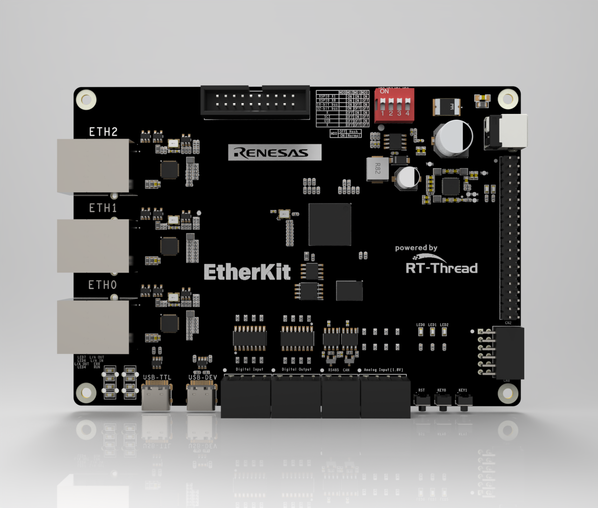

# EtherKit (RZ/N2L) RT-Thread BSP + OneNET MQTT Demo

**English** | [**中文**](./README_zh.md)

## What is this

This repository contains an RT-Thread BSP for the **Renesas RZ/N2L EtherKit** development board, plus an example application that connects to **OneNET** via MQTT (based on `kawaii-mqtt`).

You can:

- Build and run RT-Thread on EtherKit
- Use Ethernet networking and MQTT
- Report properties to OneNET using the provided topics

## Hardware

- MPU: R9A07G084M04GBG, up to 400MHz, Arm Cortex®-R52
- Debug: Onboard J-Link

## Getting started

This BSP supports GCC/IAR workflows. Use whichever toolchain you already have.

### Build (IAR)

1. Generate IAR project:

   - Open ENV in the project root
   - Run: `scons --target=iar`

2. Open `project.eww` in IAR, then **Download and Debug**.

### Build (GCC)

For GCC, configure your toolchain path via environment variable `RTT_EXEC_PATH` (it should point to the directory containing `arm-none-eabi-gcc`).

### Serial output

- 115200-8-1-N
- Type `help` in the RT-Thread shell

## Application entry

Main entry is `void hal_entry(void)` in `src/hal_entry.c`.

## OneNET configuration (IMPORTANT: token is not committed)

`src/onenet_config.h` contains non-sensitive settings like host / product id / device name.

The OneNET token **must not be committed**. Do this:

1. Copy `src/onenet_secrets_example.h` to `src/onenet_secrets.h`
2. Generate token via `scripts/onenet_token.py`
3. Paste it into `src/onenet_secrets.h`

`src/onenet_secrets.h` is ignored by git.

## Directory layout

- `src/`: application and demo code
- `board/`: board ports and pin config
- `rzn_cfg/`: FSP configuration headers
- `rzn_gen/`: generated HAL code
- `scripts/`: helper scripts

## Notes for public GitHub backup

This repo intentionally ignores local/IDE metadata and local secrets (see `.gitignore`).
